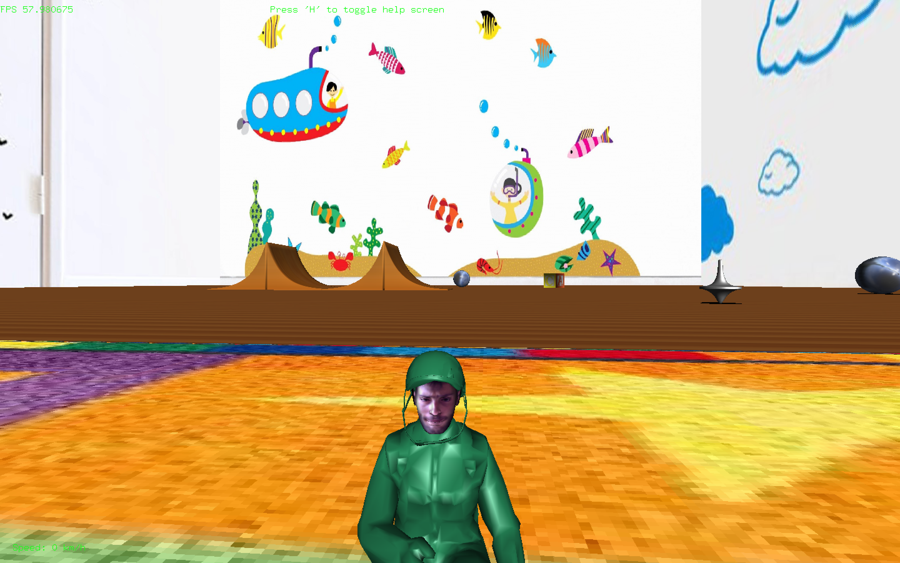

# Final Project - Computer Graphics 2018

# Final Project - Computer Graphics 2018

## **Introduzione**
Questo progetto è stato realizzato in **C++** (standard 11) con 
- **OpenGL** (2.1+)
- **GLUT / FreeGLUT**
- **SDL_Image** (per il solo caricamento di textures)

E' stato realizzato e testato su **MacOS 10.12**, ma *dovrebbe* funzionare ugualmente anche su versioni più recenti (ammesso che i framework richiesti si trovino nelle posizioni di default).

La compilazione *dovrebbe* essere possibile mediante un semplice ```make```, lasciando che sia l'opportuno ```makefile``` a fare il resto. Il makefile internalmente usa ```g++``` (```gcc```), ma *teoricamente* qualsiasi altro compilatore che supporti lo standard 11 dovrebbe funzionare, previa opportuna specifica nel makefile.

Il progetto è fortemente ispirato a ```Car4``` (progetto di esempio mostrato a lezione), dal quale sono state riusate varie idee. Tuttavia, questo progetto si pone l'obiettivo di superare ```Car4``` migliorandone vari aspetti tecnici, come ad esempio le performance e il livello di dettaglio del mondo.

-----
## Indice
- [Final Project - Computer Graphics 2018](#final-project---computer-graphics-2018)
- [Final Project - Computer Graphics 2018](#final-project---computer-graphics-2018)
    - [**Introduzione**](#introduzione)
    - [Indice](#indice)
    - [**Il Gioco**](#il-gioco)
    - [**Controlli**](#controlli)
    - [**Funzionalità OpenGL utilizzate**](#funzionalit%C3%A0-opengl-utilizzate)
    - [**Fisica**](#fisica)
        - [*Realizzazione dei controlli*](#realizzazione-dei-controlli)
        - [*Terreni, salite e collisioni*](#terreni-salite-e-collisioni)
        - [*Movimento degli oggetti*](#movimento-degli-oggetti)
    - [**La UI**](#la-ui)
    - [**Il codice** e la sua (non) organizzazione](#il-codice-e-la-sua-non-organizzazione)
        - [La cartella ```Geometry/```](#la-cartella-geometry)
        - [Componenti chiave](#componenti-chiave)
    - [**Potenziali problemi**](#potenziali-problemi)

----
## **Il Gioco**
La scena è ambientata nella stanza di un bambino, con il pavimento, in finissimo parquet, cosparso di alcuni suoi giochi.
Al giocatore è delegato il controllo di una moto giocattolo, alla cui guida si trova un soldatino, altrettanto giocattolo, con le fattezze dell'autore (ossia la faccia, giustamente turbata e perplessa dalla situazione).
La moto e il soldatino possono compiere alcune evoluzioni saltando su rampe e muovendosi liberamente nell'ambiente. L'unica regola è il cercare di non schiantarsi sui muri e sui vari oggetti presenti nella scena (nel qual caso, il gioco finisce). Si ignorino le evidenti violazioni del codice della strada e il casco non adeguatamente allacciato.




-----
## **Controlli**

I controlli sono relativamente pochi:
- ```WASD``` keys per il movimento
- ```1``` per cambiare la camera
- ```2``` per attivare/disattivare il rendering in wireframe *"leggero"* (solo linee, non colorazione)
- ```3``` per trasformare in cristallo alcuni oggetti (cioè rendendoli trasparenti).
- ```4``` per attivare/disattivare le luci frontali
- ```5``` per attivare/disattivare le ombre
- ```0``` per attivare una resa in wireframe "pieno" (con anche colorazione), **ma a costo di dimezzare gli FPS** (da 60 a 30, di fatto occorre renderizzare due volte la scena, una volta per le linee e una volta per riempire)
- ```P``` per attivare/disattivare il movimento di alcuni oggetti
- ```M``` per attivare/disattivare la minimappa
- ```H``` per mostrare/nascondere l'help in-game
- ```Q```/```ESC``` per uscire.

Tra le varie opzioni possibili sulla camera, c'è anche il controllo manuale mediante mouse. Tuttavia, dato il limitato supporto che OpenGL + GLUT fornisce agli eventi legati alla rotella del mouse, quel tipo di interazione può risultare non molto intuitivo.

In quella modalità, si usi
- ```RMB``` (tasto destro) per allontare la visuale
- ```MWB``` (pressione sulla rotella) per avvicinare la visuale
- ```LMB``` (tasto sinistro) per trascinare e cambiare l'angolo di vista.


> Non è garantito, al momento, **nessun tipo di interazione via joystick**, principalmente a causa della carenza di hardware con cui testare da parte di chi scrive. *Dovrebbe* comunque essere possibile guidare la moto con il joystick (nel modo intuitivo), ma senza nessuna particolare finezza. La gestione degli eventi joystick è stata realizzata "al buio" e potrebbe per questo essere difettosa.

----

## **Funzionalità OpenGL utilizzate**

* Illuminazione dinamica
* Applicazione di (numerose) textures sia a (numerosi) oggetti mesh caricati dinamicamente che a figure statice (i.e. *quads*)
    * Sia mediante generazione automatica del mapping sulle coordinate texture che non (i.e. specificandole esplicitamente)

* Resa di ombre
* Resa di trasparenze
* Resa in wireframe
* Resa di testo a schermo (mediante l'uso di primitive GLUT, per semplicità)

Il progetto probabilmente non brilla per orginalità, tuttavia è stata dedicata particolare attenzione ad alcuni aspetti.

In primissimo luogo: **l'efficienza**, si è cercato di ottimizzare al meglio in modo tale che il gioco possa eseguire a 60fps stabili (o quasi).
Questo obiettivo è stato raggiunto prinicipalmente mediante l'ottimizzazione delle fasi di rendering in modo da non dover iniviare a ogni frame tutta la geometria alla GPU, ma facendo in modo che questa risieda già in memoria dal principio (da dopo il primo frame).
OpenGL "moderno" offre anche la possibilità di programmare (quasi) interamente la pipeline grafica, con l'ausilio di opportuni shaders, per ottenere performance ancora migliori. Tuttavia questa strada non è stata perseguita fino in fondo, soprattutto visto il raggiungimento degli agognati 60fps con l'uso di semplici buffer di memoria (e vari accorgimenti).

Più nel dettaglio, prima di cominciare con il rendering del primo frame, tutti i vari vertici (e le relative normali) sono inviati e salvati in opportune aree di memoria all'interno della GPU. Il rendering, semplicemente consiste nello specificare alla GPU dove andare a prendere i dati opportuni, senza perdere tempo a reinviarli. E' importante notare che, in fase di rendering, si è scelto di disegnare triangoli, e per tanto le varie mesh devono essere bufferizzate sulla GPU sottoforma di array di triangoli (array di vertici in cui ogni 3 vertici si è fatto un triangolo). Per rendere semplice l'inizializzazione, quindi, si è scelto di "triangolare" ogni mesh (offline, con Blender) e di eliminare ogni oggetto "aperto", estrudendo anche solo leggermente ogni superficie e chiudendo le superfici concave. Questo permette di stabilire "facilmente" la dimensione che il buffer occuperà nella GPU, siccome ogni vertice sarà utilizzato un numero noto di volte.

In secondo luogo, si è cercato di dare un senso di realismo e coerenza al tutto, realizzando un supporto basilare per la fisica. In particolare, è stato necessario studiare un modo per far sì che la moto seguisse i vari tipi di terreno sia in termini di elevazione che di inclinazione. Maggiori dettagli nel seguito, alla sezione [**Fisica**](#Fisica).

Per quanto riguarda la resa delle ombre, si è adottato un approccio molto simile a quello già presente in ```Car4```, nel quale le ombre sono rese appiattendo sul piano XZ gli oggetti e rendendoli di colore scuro. A questo, sono stati aggiunti alcuni effetti:

* Della semplice matematica per far sì che l'ombra rimanga sempre attaccata al suolo (e che non voli con la moto)
* Altra semplice matematica per far sì che l'ombra dei grandi oggetti presenti nella scena abbia un'interazione semi-realistica con le fonti mobili di luce (i.e.: i "fanali" della moto): se le luci sono vicine, l'ombra si affievolisce fino a (quasi) sparire. 

Nella sua semplicità ed efficacia, questa soluzione ha dei limiti, discussi leggermente più nel dettaglio nella sezione [**Potenziali problemi**](#Potenziali-Problemi).

La resa delle trasparenze non è particolarmente meritevole, si ha avuto cura di rendere gli oggetti trasparenti per ultimi, in ordine calante di vicinanza al giocatore, in modo da garantire il corretto gioco delle trasparenze. L'unica accortezza avuta, al fine di evitare spiacevoli sovrapposizioni tra le varie facce dello stesso oggetto trasparente, è stata l'abilitare il *face culling* già gentilmente offerto da OpenGL prima della resa.

In effetti, il face culling è stato abilitato in praticamente tutte le rese, con la sola eccezione della resa di cubi. I cubi mostrati nel gioco sono di due nature: dadi e muri. I dadi devono essere visibili *dall'esterno*, mentre i muri *dall'interno*. Questo crea conflitto qualora si decida di usare il face culling in entrambi i casi. Le soluzioni possibili erano due: o specificare orientazioni diverse per le facce dei cubi di diversa natura o disabilitare il face culling durante la resa dei cubi. Si è optato per la seconda.

----

## **Fisica**
La fisica è fortemente ispirata a quella utilizzata nel progetto ```Car4```, dal quale, come accennato, questo progetto trae ampia ispirazione.

### *Realizzazione dei controlli*
In particolare, i controlli e la meccanica di base sono pressoché identici. Le differenze principali sono legate al fatto che l'andatura tipica di una moto è ben diversa da quella di una macchina (che, auspicabilmente, non piega in curva).

La realizzazione delle pieghe nelle curve è stata relativamente semplice: è stato sufficiente inclinare tutta la moto di un angolo proporzionale allo sterzo e alla velocità (lineare) attuale. Al fine di evitare facili sensi di nausea in retromarcia, si ha avuto cura di far sì che l'angolo di inclinazione sia sempre rivolto (acuto) verso il centro della curva.

L'implementazione concreta dei controlli è stata quasi interamente tratta da ```Car4``` con solo minime e marginali modifiche, per lo più motivate solo dalla diversa gestione degli eventi GLUT rispetto ad SDL.

### *Terreni, salite e collisioni* 
Questa parte, invece, è stata realizzata da zero, in quanto completamente assente in ```Car4```. A una mente esperta ed allenata probabilmente sembrerà banale, sicuramente non particolarmente intelligente, ma è il meglio che l'autore sia riuscito a concepire.

 La sfida chiave per tutto è la seguente:
> Dato un punto del mondo (3D) capire quale sia la coordinata Y (l'altezza) del vertice più vicino della mesh sottostante (più prossima).

Questo è un problema altamente ricorrente (con diverse sfumature) in tutta la Computer Graphics, solitamente risolto con varianti del ray-tracing.
Ammesso di avere a disposizione l'algoritmo di ray-tracing, la soluzione sarebbe immediata. Il problema, però, è che tipicamente il ray-tracing è lento (senza contare che l'uso di librerie esterne è stato espressamente proibito e pertanto che lo si sarebbe dovuto realizzare ex-novo). Per questo, si è adottato un approccio diverso.

Il mondo è stato diviso in varie ```Tiles```, dove una ```tile``` corrisponde a un ostacolo fisico (una rampa, un dado...). Ogni ```tile``` è associata ad una mesh per la quale si tiene traccia anche delle varie trasformazioni (rotazioni, traslazioni, scale).

Il trucco consiste nel fatto che, per ogni oggetto fisico su cui la moto può salire, è nota l'espressione della superficie in forma chiusa, ossia è nota una funzione ```F(x,y,z) = 0``` che descriva esattamente la superficie in questione.

In questo modo, capire a che altezza si deve trovare la moto per restare sopra la superficie è semplice, date le coordinate "mondo" della moto:

1. Decido in quale ```tile``` mi trovo: le ```tiles``` sono in numero limitato, posso con semplici test (e qualche ottimizzazione) capire un punto a quale appartenga in maniera efficiente.
2. Stabilita la ```tile```, trasformo le coordinate mondo in ```coordinate "tile"``` annullando ogni trasformazione abbia subito la ```tile``` in fase di setup (traslazioni, scale, rotazioni, tutte opportunamente tracciate).
3. Applico il modello intrinseco della ```tile``` e scopro il valore della coordinata Y (l'altezza), lungo quella superficie. In altre parole, in questo step, calcolo la funzione nota a priori.


Ora è possibile anche stabilire se la moto si schianta contro un muro: se la nuova altezza è "troppo elevata" rispetto alla attuale, è un muro.

Con questa conoscenza in tasca, la moto è in grado di seguire alla lettera ogni superficie, ma mancano ancora due ingredienti fondamentali:
- La corretta inclinazione della moto lungo i vari terreni
- La possibilità di effettuare salti!

Stabilire l'inclinazione è relativamente semplice. Inizialmente, si era pensato di calcolare l'altezza della superficie sulla ruota anteriore, l'altezza sulla ruota posteriore ed inclinare di conseguenza. Per quanto teoricamente possibile, questo metodo si è mostrato numericamente inaffidabile e difficile da correggere, per cui si è ripiegato su un approccio più uniforme con quanto fatto fino a questo punto.

Nonostante dovesse essere conoscenza pregressa ampiamente consolidata, un buon ripasso di Analisi ha permesso di ricordare che, data una superficie nella forma ```F(x,y,z)=0```, il suo gradiente è perpendicolare alla superficie, punto per punto. A questo punto, è stato "banale" (si notino le virgolette) trovare la direzione in cui indirizzare la moto, ragionando esattamente come in precedenza:

1. Trovo la ```tile``` in cui è locata la moto
2. Mi riporto in coordinate ```tile```
3. Calcolo il gradiente, semplicemente applicando calcoli (in pratica 3 funzioni) precedentemente risolti a mano su carta (d'accordo, magari in alcuni casi con l'aiuto di qualche strumento che calcola le derivate automaticamente).

Ora, avendo la normale alla superficie e avendo la normale attuale si può facilmente ricavare l'angolo di cui correggere l'inclinazione mediante un ```acos``` e un prodotto scalare, in modo da far sì che la normale attuale coincida con la normale alla superficie.

Questo approccio funziona, ma non è esattamente realistico. Questa volta non è stato necessario ragionare a lungo, perché il problema (e la soluzione) erano evidenti da subito: le derivate andrebbero calcolate nella direzione di moto, se la moto si muove perpendicolare al gradiente, l'inclinazione deve essere 0. Questa considerazione porta quindi a uno step ulteriore:

4. Trovare il prodotto scalare tra la velocità (normalizzata) e la normale calcolata al punto 3.

A questo punto è possibile capire l'angolo di cui ruotare la moto (idealmente, di cui ruotare il vettore velocità) con un semplice ```acos```, in modo tale che la velocità risulti sempre perpendicolare alla normale.

Anche questo metodo ha la sua buona dose di incertezza, dato il dover passare per una funzione dal dominio ristretto come l' ```acos```. In particolare, se ruotassimo davvero il vettore velocità, ossia aggiornando congruemente i valori della velocità "orizzontale" e i valori della velocità "verticale", si verificano situazioni spiacevoli in cui i valori degenerano (```NaN```) portando alla scomparsa (assai prematura) della moto e del soldatino. Sicuramente, una persona più intelligente del sottoscritto potrebbe agilmente trovare i problemi e correggerli, ma siccome il tempo e il Q.I. dell'autore sono ampiamente limitati, si è deciso di vivere con una fisica semplificata che, pur essendo *quasi* verosimile agli occhi, di fatto imbroglia. In pratica, quindi, la velocità verticale non è mai variata e semplicemente si corregge la posizione verticale a mano.

L'ultimo step rimasto è rendere la moto in grado di fare "salti".
A questo punto, la stessa persona più acuta di cui sopra, avendo un vero vettore velocità, con componenti veritiere, potrebbe agilmente applicare banali leggi da prima superiore sul moto uniformemente accelerato ed ottenere risultati perfetti. L'autore, invece, ha deciso di andare fino in fondo con un approccio "trompe l'oeil" e semplicemente far sì che, qualora la moto si trovi sensibilmente al di sopra della sua superficie sottostante, la sua altitudine sia calata linearmente fino a raggiungimento della superficie.
Questo è chiaramente fisicamente sbagliato, ma, per piccoli salti, la differenza non è incredibilmente netta. Si ha avuto cura di rendere *piccoli* tutti i salti possibili.

Come probabilmente è trasparso, c'è una discreta quantità di tuning a mano di vari parametri, per il quale si è deciso di omettere i dettagli; non ci sono stati particolari ragionamenti, solo vari tentativi.

Infine, nei (rari) momenti in cui la moto è "in aria", si potrebbero disattivare i comandi di sterzo per un approccio ancora più realistico. Tuttavia, onde fornire un minimo di divertimento, si è scelto di permettere di guidare la moto anche in aria, ossia di dare la possibilità di cambiare direzione di moto anche in volo.

### *Movimento degli oggetti*
Il movimento dei giocattoli è stato realizzato nel modo più banale e pedissequo che si possa immaginare, aggiornando a ogni frame dei valori di posizione/inclinazione sulla base di velocità prefissate. 
Degli altrettanto banali controlli permettono di evitare che gli oggetti lascino la scena e di fermarli a piacimento.

-----

## **La UI**
La UI è stata disegnata per avere il minimo impatto sulle perfomance. In particolare, tutto il testo mostrato dinamicamente (FPS, velocità e tooltip) è mostrato mediante opportuno (e assai ristretto) wrapper delle efficienti primitive GLUT, che permettono di mostrare un carattere alla volta, in modo da mostrare stringhe arbitrarie. 

Per quanto riguarda il menù comandi e la minimappa, si è optato per una realizzazione "offline". Entrambi, infatti, sono mostrati come semplici texture applicate ad opportuni ```quad```.

La barra laterale che mostra un feedback visivo della velocità è **ampiamente** ispirata alla barra dei FPS già presente in ```Car4```: un quad di colore (in questo caso) fisso (e non più proporzionale all'altezza) e di altezza proporzionale alla velocità.


-----

## **Il codice** e la sua (non) organizzazione
Anzitutto, occorre specificare che l'autore non è particolarmente famoso come autore di buon codice C++ e che, tra altri difetti, annovera anche la predilezione per codice "single header", ossia in cui sia la dichiarazione di classi che la loro implementazione risiede in un singolo header file. Questa abitudine, nata più che altro da esigenze assolutamente irrilevanti in questo progetto, porta all'esistenza di un singolo ```.cpp``` file in tutto il progetto (il main) e a molti (e lunghi) headers.

Molte parti del codice partono da ```Car4``` per poi prendere la propria (tumultuosa) strada.

### La cartella ```Geometry/```
In questa cartella si sono concentrati varie utilità per il calcolo e per la geometria, tutte ampiamente ispirate da ```Car4```.
Da ```Car4``` è stata presa la classe ```Mesh```, elaborata ed estesa in modo da usare la resa "bufferizzata" discussa in precedenza. Si è operata questa scelta soprattutto per poter riutilizzare anche il codice che carica oggetti mesh da file ```.obj```. Tutto questo è stato sintetizzato nel singolo header ```Geometry/sMesh.h```.
Il file ```geometry.h``` racchiude invece tutte le definizioni di punti e vettori, interamente riciclate da ```Car4```.


### Componenti chiave
Chiaramente, al centro di tutto, si trova ```main.cpp```, che comanda tutte le operazioni e mantiene alcune (troppe) variabili globali per facilitare varie funzionalità realizzate in altri header.

In particolare, si evidenziano due header centrali:
* ```world.h```
* ```vehicles.h```

Il primo si occupa di gestire, inizializzare e disegnare ogni oggetto della scena (i.e. ogni ```tile```, il pavimento e i muri della stanza).
Questo è probabilmente l'unico file con una parvenza di struttura e logica. In particolare, definisce la classe ```World```, nel cui costrutture si trovano (duramente cablati) tutti i parametri di inizializzazione della scena e delle varie ```tile```.

Il file ```vehicles.h```, si occupa di gestire la moto. L'header è titolato al plurale perché nasce come generalizzazione del già esistente ```car.h``` (di ```Car4```). Ai fini dello sviluppo e del testing, si è trovato comodo a un certo punto avere a disposizione un'interfaccia generica sia per la macchina che per la moto, così da poterli usare indifferentemente, in modo da differenziare i problemi legati alla grafica da quelli legati alla povertà del codice. A progetto concluso, si è deciso di mantenere l'interfaccia generica al fine di facilitare un ipotetico riuso in un (remoto) futuro.

Come si può facilmente supporre, di vitale importanza è il file ```tiles.h```, che definisce e racchiude tutte le varie ```tile```.
Queste sono strutturate secondo una tassonomia (non particolarmente utile) che vede in cima una classe astratta ```Tile```. Questa definisce tutti i metodi necessari alle varie sottoclassi, implementandone la maggior parte in maniera base. In particolare implementa una versione base del metodo ```Draw()```. Le sottoclassi con esigenze speciali (come le biglie, che diventano trasparenti all'occorrenza), devono ridefinirlo mentre altre classi (come le varie rampe) che invece non hanno effetti speciali, richiedono minimo lavoro.

Ogni tile deve necessariamente specificare come calcolare l'altezza e la normale nei suoi punti. Per quanto questo fosse teoricamente possibile in praticamente tutte le tile (magari con la sola eccezione della trottola, data la sua forma particolare), si è scelto di semplificare vari calcoli per le tile in cui non sia possibile (fisicamente) salire in nessun modo (e.g. le biglie, i cubi). Per queste tile, si è scelto di ritornare un valore fisso molto alto per l'altezza in modo che a qualsiasi contatto, la moto venga distrutta.

Il file ```utils.h``` riassume vari metodi di utilità per la gestione delle textures e il disegno di cubi/quads. In particolare, dato l'elevato numero di texture presenti nel progetto, usando i soli bindings OpenGL nella forma ```glBindTexture(GL_TEXTURE_2D, 6)```, era facile perdere di vista la corrispondenza "numero - texture".
Per questo si è realizzata la classe ```TextureProvider```, un singleton (classe di cui esiste una sola istanza nel codice) che offra un punto di accesso centralizzato alle texture, e che permetta di essere più chiari, a colpo d'occhio, riguardo a quale texture si stia usando (e.g.: ```provider->BindTexture(GL_TEXTURE_2D, "Resources/wood.jpg")```).
Questa classe è anche usata per caricare le texture, fornendo quindi un punto unico di gestione degli errori e quindi la possibilità di fornire messaggi più mirati in caso di fallimento.

Infine, ```common.h``` è un file praticamente copiato e incollato da esempi mostrati a lezione. Esso contiene altre varianti della geometria e varie funzioni utilità per l'uso di shaders (che tuttavia non sono impiegati nel progetto). E' tenuto più come "porta fortuna" che per reale utilità. Vi sono state definite varie costanti e parametri usati altrove nel progetto e usato come base di "normalizzazione" delle librerie grafiche importate, in modo che tutti gli altri header restino coerenti.


----

## **Potenziali problemi**
1. Uso prolungato (15+ minuti, variabile con la temperatura atmosferica) può causare *surriscaldamento* del PC. Questo è dovuto a una serie di scelte e comportamenti adottati che sacrificano un sano uso di risorse sull'altare dei FPS. In particolare, si è scelto di *non attendere* il completamento delle operazioni di resa di un frame prima di iniziare a lavorare sul successivo (ossia, nessuna chiamata ```glFinish()```). Questo non causa nessun difetto (apparente) nella resa, ma priva la GPU di momenti in cui la pipeline è inattiva; in altre parole, si priva la GPU di importanti momenti per raffreddarsi, provocando, alla lunga, probabile surriscaldamento.

> In sintesi, sebbene lo scopo del gioco sia non far morire il soldatino, si consiglia di terminare la sua esistenza entro 15-20 minuti.

2. In fase di compilazione si possono ricevere **numerosi** warning, per lo più concernenti l'uso di funzionalità deprecate. Si ignorino serenamente.

3. L'interazione fanali-ombre è pseudoveritiera finché la moto resta ragionevolmente "davanti" all'oggetto in questione. Se la moto si posiziona in modo da colpire con i fanali solo marginalmente l'ombra, questa viene comunque interamente sbiadita, anche se nella realtà solo una parte di essa (o nulla) sarebbero colpite dalla luce. Questo problema non si può facilmente risolvere, in quanto richiederebbe una decisione punto per punto della quantità di luce ricevuta (in maniera analoga a certe tecniche di resa *"offline"*, assolutamente troppo costose). 


